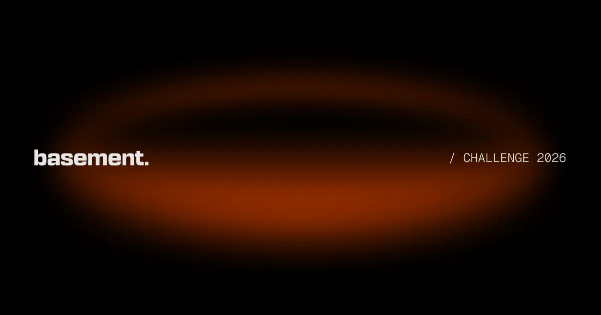
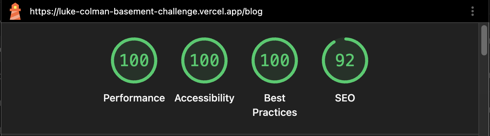
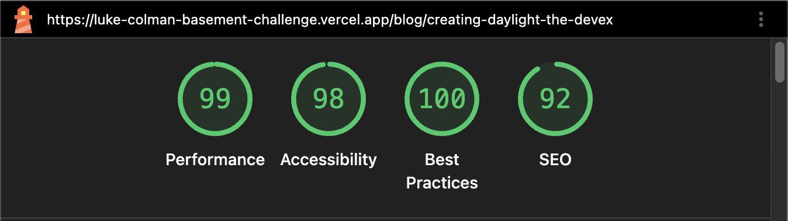

# Lucas Colman x Basement - Frontend Challenge

Responsive blog built with Next.js, TypeScript, Tailwind CSS, Motion, GSAP, and Sanity.



## How to run

```bash
pnpm install
pnpm dev
```

Create `.env.local` from `.env.example` and configure the Sanity project values and the local site URL.

Production URL: [luke-colman-basement-challenge.vercel.app](https://luke-colman-basement-challenge.vercel.app)

## Verification

```bash
pnpm install --frozen-lockfile
pnpm lint
pnpm typecheck
pnpm run build
```

The project was validated through linting, type checking, production builds, manual keyboard navigation, and Lighthouse audits.

## Implemented features

- Responsive blog layout.
- Article listing, detail pages, categories, and filtering.
- Editable posts, categories, authors, labels, SEO, logo, and social image through Sanity.
- Global and post-specific metadata, sitemap, robots, and optimized images.
- Sanity Studio available at `/studio`.
- Keyboard-accessible navigation, skip link, focus states, mobile menu, focus trap, and Escape handling.
- Motion- and GSAP-based interactions that respect the user's reduced-motion preference.
- Local fallbacks for essential settings when Sanity is unavailable.

### Sanity content architecture

```text
Sanity
├── Posts          content, Portable Text, images, categories, SEO
├── Categories     titles, slugs, descriptions
├── Authors        names and profile information
└── Site settings  navigation, labels, SEO, logo, social image, footer
```

## Technical decisions

- Server Components by default; Client Components are limited to interactive behavior.
- Tailwind CSS is used for styling and shared design tokens.
- Motion and GSAP are used for subtle interactions, with animation logic isolated in dedicated components.
- Sanity data access, content schemas, and image helpers are centralized in `src/sanity`.
- Reusable UI, layout, blog, and motion components keep the interface modular.
- Sanity data uses Next.js server-side caching with a 60-second revalidation window.
- The local social image is stored as WebP to keep its file size low. Content images are requested from Sanity at the size needed by each component and rendered with `next/image`.

### Folder structure

```text
src/
├── app/         routes, layouts, metadata, sitemap, and robots
├── components/  reusable UI, layout, blog, and motion components
├── sanity/      client, GROQ queries, schemas, and image helpers
├── types/       shared post, category, author, and image types
└── styles/      global styles and design tokens
public/          local fallback assets
```

## Trade-offs and caveats

- Essential settings have local fallbacks so a Sanity issue does not break technical pages.
- Content can remain cached for up to 60 seconds before a new Sanity response is fetched; in the future, a secure Sanity webhook could be integrated to invalidate the cache on demand when content is published.
- During the initial Vercel setup, the pnpm lockfile required a small correction before the production build could run successfully.

## Lighthouse audit

Audited in an incognito window without browser extensions against the production site.

| Page | Performance | Accessibility | Best Practices | SEO |
| --- | ---: | ---: | ---: | ---: |
| Blog | 100 | 100 | 100 | 92 |
| Article | 99 | 98 | 100 | 92 |

### Blog



### Article


